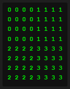
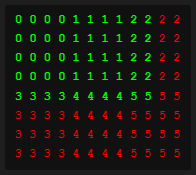

# DXT Block (BC)  

DXT texture is made up of 4x4 blocks

Each pixels block (8x8)  

  
Because each block is 4x4 pixels the whole image width & height must be a multiple of 4!  
There is a workaround for this however.  
The image can be any size but the data is actually padded to fit the size  
  
Padded pixels block (10x5)  


# DXT1 Block

Each block is 64 bits in total (4 bits per pixel)
DXT1 block is as follows
```c++
struct DXT1_Block {
    // Color palette
    Uint16 color0; // (RGB565)
    Uint16 color1; // (RGB565)
    // IF color0 > color1
        // color2 = 2/3 of color0 + 1/3 of color1
        // color3 = 1/3 of color0 + 2/3 of color1
    // ELSE
        // color2 = 1/2 of color0 + 1/2 of color1
        // color3 = black OR transparent (ONEBITALPHA)

    // Pixels to pick color from palette
    Uint2 pixels[16];
}
```

# DXT3 Block

DXT3 SHOULD NOT BE USED (DXT5 IS MUCH BETTER)

Each block is 128 bits in total (8 bits per pixel)
DXT3 block is as follows
```c++
struct DXT3_Block {
    // Color palette
    Uint16 color0; // (RGB565)
    Uint16 color1; // (RGB565)
    // color2 = 2/3 of color0 + 1/3 of color1
    // color3 = 1/3 of color0 + 2/3 of color1

    // Pixels to pick color from palette
    Uint2 pixels[16];

    // Alpha transparency per pixel
    Uint4 alphas[16];
}
```

# DXT5 Block

Each block is 128 bits in total (8 bits per pixel)
DXT5 block is as follows
```c++
struct DXT5_Block {
    // Color palette
    Uint16 color0; // (RGB565)
    Uint16 color1; // (RGB565)
    // color2 = 2/3 of color0 + 1/3 of color1
    // color3 = 1/3 of color0 + 2/3 of color1

    // Pixels to pick color from palette
    Uint2 pixels[16];

    // Alpha palette
    Uint8 alpha0;
    Uint8 alpha1;
    // IF alpha0 > alpha1
        // alpha2 = (6*alpha0 + alpha1) / 7
        // alpha3 = (5*alpha0 + 2*alpha1) / 7
        // alpha4 = (4*alpha0 + 3*alpha1) / 7
        // alpha5 = (3*alpha0 + 4*alpha1) / 7
        // alpha6 = (2*alpha0 + 5*alpha1) / 7
        // alpha7 = (alpha0 + 6*alpha1) / 7
    // ELSE
        // alpha2 = (4*alpha0 + alpha1) / 5
        // alpha2 = (3*alpha0 + 2*alpha1) / 5
        // alpha2 = (2*alpha0 + 3*alpha1) / 5
        // alpha2 = (alpha0 + 4*alpha1) / 5
        // alpha6 = 0
        // alpha7 = 255

    // Alphas to pick alpha from alpha palette
    Uint3 alphas[16];
}
```
  
# Other Information  
  
[DXT/BC Implementation](https://github.com/microsoft/DirectXTex)  
  